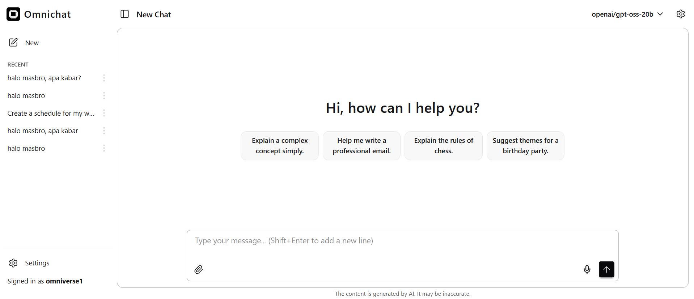

# Omnichat: A Minimal Interface for Local AI Companion

**Omnichat** is an open-source desktop application providing a clean, user-friendly interface for interacting with **Large Language Models (LLMs)** powered by `llama.cpp`. Designed with a focus on simplicity and privacy, this project lets you chat with powerful quantized models **locally on your machine**, requiring no cloud connection.

This repository is a fork of the `llama.cpp` WebUI with improvements focused on:

- **Refreshed Styling**
- **Extra Functionality**
- **Smoother User Experience**



---

## Key Features

### Flexible Integration

- Supports multiple inference providers, including **llama.cpp, LM Studio, Ollama, vLLM, OpenAI,** and many more.

### Conversation Management

- **IndexedDB** storage for conversations.
- **Branching conversation** support, allowing message edits while preserving history.
- **Import/Export** functionality.

### Rich User Interface (UI)

- **Markdown rendering** with syntax highlighting.
- **LaTeX math** support.
- File **attachments** (text, images, PDFs).
- Theme customization using **DaisyUI**.
- Responsive design for mobile and desktop.

### Advanced Capabilities

- **PWA (Progressive Web App)** support with offline capabilities.
- **Streaming responses** via Server-Sent Events.
- Customizable generation parameters.
- Performance metrics display.

### Core Principles

- **Privacy Focused**: All data is stored locally in your browser—no cloud required.
- **Localized Interface**: Most popular language packs are included and can be selected at any time.

---

## Getting Started

You have two primary ways to run Omnichat:

### 1. Standalone Mode (Zero Installation)

This method assumes your local `llama.cpp` server is already running (e.g., at `http://localhost:8080`).

1. Open our hosted UI instance at [https://omnichat.io/](https://omnichat.io/).
2. Navigate to General settings (gear icon).
3. Set the **"Base URL"** to your local `llama.cpp` server address (e.g., `http://localhost:8080`).
4. Start chatting with your AI.

<details>
<summary><b>Note: Handling HTTPS/HTTP Conflict</b></summary>
<br>
If you run the UI from an **HTTPS** address and your `llama.cpp` server uses **HTTP**, browsers will block the requests. You can use a tool like **mitmproxy** to create an HTTPS-to-HTTP bridge:

**Local mitmdump Setup:**

```bash
mitmdump -p 8443 --mode reverse:http://localhost:8080/
```
